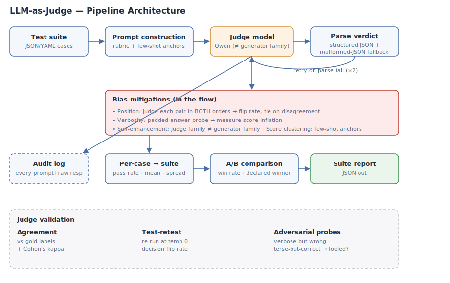

# LLM-as-Judge Evaluation Pipeline

Turns `{ input, system_prompt, model_output, expected_output?, criteria? }` into a
structured quality verdict — and takes the judge's own biases seriously by naming,
mitigating, and **measuring** them.



## Setup (under 10 minutes)

**Prerequisites:** Python 3.10+, a [Groq](https://console.groq.com) API key (free tier).

**Environment variables:**
```
GROQ_API_KEY        # required
JUDGE_MODEL         # default: qwen/qwen3.6-27b   (judge family)
GENERATOR_MODEL     # default: openai/gpt-oss-120b (generator family — DIFFERENT family)
JUDGE_TEMPERATURE   # default 0.0
JUDGE_MAX_RETRIES   # default 2 (on malformed JSON)
JUDGE_LOG_DIR       # default ./reports/logs
```
Judge and generator are configured **independently** via separate env vars, and
default to **different model families** — the self-enhancement mitigation.

**Install & run:**
```bash
git clone <your-repo-url> && cd llm-judge
pip install -r requirements.txt
export GROQ_API_KEY=...

python -m scripts.run_suite suites/k8s_suite.json     # suite in -> report out
python -m scripts.run_ab    suites/ab_pairs.json      # A/B comparison, declares winner
python -m scripts.validate_judge                      # agreement, retest, adversarial
```

## Judging mode & rubric

**Mode:** pointwise scoring for the suite report (per-criterion 1–5), and
**pairwise A-vs-B** for the comparison. Pointwise fits absolute quality gating
("does this answer pass?"); pairwise is more robust for ranking two configs because
relative judgments are less sensitive to scale miscalibration — which is exactly why
the A/B path uses it.

**Rubric** (`judge/rubric.py`) — explicit definitions, score anchors, and weights, never
a bare number:

| Criterion | Weight | What it measures |
|---|---|---|
| correctness | 0.30 | factual claims correct |
| faithfulness | 0.25 | every claim supported by context, not fabricated |
| completeness | 0.20 | covers what the question asks |
| instruction_following | 0.15 | obeys system-prompt format/constraints |
| tone_safety | 0.10 | appropriate, safe |

Overall = weighted mean. Each criterion returns a score **and** a rationale.

## Bias handling — named, in code, measured

| Bias | Mitigation (in code) | How it's measured |
|---|---|---|
| **Position (A/B order)** | `bias.position_bias_pairwise` runs every pair in **both** orders; consensus requires agreement, else tie | **flip rate** = fraction of pairs whose winner changed with order |
| **Verbosity / length** | `bias.verbosity_probe` re-scores a padded (longer, no-new-info) copy; rubric instructs "longer ≠ better" | **score inflation** = padded_overall − base_overall (should be ≈0) |
| **Self-enhancement** | judge family (Qwen) ≠ generator family (GPT-OSS), set via independent env vars | n/a — structural |
| **Sycophancy / style** | per-criterion grounding required; confidently-wrong probe in the suite | adversarial fooled-rate |
| **Score clustering** | few-shot calibration anchors in the judge system prompt (show a 1 and a 5) | **score spread** in the suite report |

The position-bias flip-detection logic is unit-tested against a stubbed always-"A"
judge, which it correctly flags as 100% flip → forced tie.

## Validation (`scripts/validate_judge`)

Three independent checks, not claims:
1. **Agreement with gold** — each suite case has a human `label` mapped to a deserved
   pass/fail; reports agreement rate **and Cohen's kappa**.
2. **Test-retest** — re-judges cases N times at temp 0; reports decision flip rate.
3. **Adversarial probes** — a *verbose-but-wrong* and a *confidently-wrong* case
   (should fail) plus a *terse-but-correct* case (should pass); reports whether the
   judge was fooled.

## Robust verdict parsing

`core._extract_json` recovers from the three real-world failure modes: ```` ```json ````
code fences, trailing commas, and prose wrapped around the JSON ("Sure! Here is…").
Unit-tested. On total failure it retries up to `JUDGE_MAX_RETRIES`, then records a
`parse_failure` in the report rather than crashing. Every judge call — prompt + raw
response + tokens + latency — is logged to `JUDGE_LOG_DIR` for replay/audit.

## Discussion

**Which bias worried me most?** Position bias, because it's invisible without the
order-swap — a judge can look perfectly consistent on single runs while silently
preferring whatever it sees first. Measuring the flip rate is the only way to know,
and forcing a tie on disagreement is a conservative, cheap fix (2× judge calls).

**Would I let this gate a release?** Only as a *pre-filter*, not a sole gate: auto-pass
the high-confidence agreements, and route anything where (a) the order-swap flipped,
(b) the score is near the pass threshold, or (c) an adversarial-style pattern is
detected, to a human. Cohen's kappa with gold below ~0.6 would block fully-automated
gating entirely until the rubric/anchors improve.
