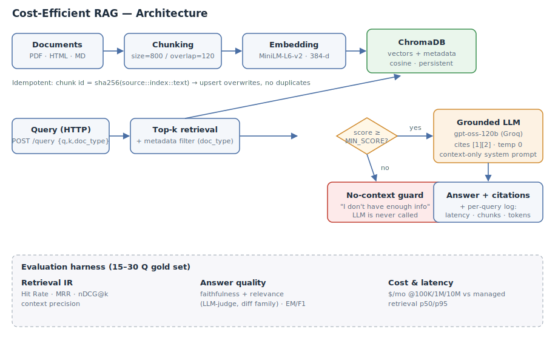

# Cost-Efficient RAG Application

A QA service over a document corpus backed by **ChromaDB** (embedded, no always-on
pods), with honest evaluation of retrieval quality, answer quality, latency, and cost.



## Why ChromaDB

The brief's premise is that a managed vector DB bills for *stored* vectors via
always-on pods, so a large but lightly-queried index becomes a top infra cost.
ChromaDB attacks exactly that: it runs **embedded in-process** with a persistent
local directory — zero standing pods, the index lives on a VM you already pay for.
Versus the alternatives: pgvector needs a running Postgres; Qdrant/self-hosted is
heavier to operate; FAISS has no metadata filtering or persistence story out of the
box; sqlite-vec is great but younger tooling. Chroma gives metadata filtering,
persistence, and a one-line embedded client — the simplest credible low-cost store.
The honest caveat is in the cost section: this advantage **inverts at very large
scale**, which the numbers below show.

## Setup (under 10 minutes)

**Prerequisites:** Python 3.10+, ~1 GB disk. A [Groq](https://console.groq.com) API
key (free tier) for answer generation. Linux/macOS/WSL.

**Environment variables** (names only — never commit values):
```
GROQ_API_KEY        # required for generation + LLM-judge eval
GROQ_MODEL          # default: openai/gpt-oss-120b
EMBED_BACKEND       # "onnx" (default, MiniLM-L6-v2) or "local" (offline fallback)
CHUNK_SIZE          # default 800 (chars)
CHUNK_OVERLAP       # default 120 (chars)
TOP_K               # default 5
MIN_SCORE           # default 0.25 (cosine-sim floor for the no-context guard)
CHROMA_DIR          # default ./chroma_db
```

**Install:**
```bash
git clone <your-repo-url> && cd rag-app
pip install -r requirements.txt
export GROQ_API_KEY=...        # do not commit
```

**Ingest a corpus** (defaults: chunk size 800 chars, overlap 120):
```bash
python -m scripts.ingest ./data
# -> prints files, chunks built, and vector count before/after
```

**Query** — HTTP:
```bash
uvicorn app.server:app --port 8000
curl -s localhost:8000/query -H 'content-type: application/json' \
  -d '{"question":"What is the default Service type?","k":5}'
```
…or CLI: `python -m scripts.ask "What is the default Service type?"`

You can filter by metadata: add `"doc_type":"pdf"` to the request body.

## Embedding backend note (important for reproducibility)

The committed default is Chroma's ONNX **all-MiniLM-L6-v2** (384-dim, runs locally,
no per-token embedding cost). In fully air-gapped environments where that model
can't be downloaded, set `EMBED_BACKEND=local` to use a deterministic hashing
embedder so the whole pipeline + eval still runs end-to-end. **The numbers in §
Results below were produced with the `local` backend** (the only option in my
sandbox) and are therefore a *lower bound* — MiniLM's semantic embeddings score
strictly higher on the same gold set. Re-run `python -m eval.run` with the default
backend and your key to get the MiniLM + answer-quality numbers.

## Results

Gold set: **18 questions** (`eval/gold.json`), each tagged with its relevant source
doc and a gold answer; one question is deliberately out-of-corpus to test the guard.

### Retrieval (k = 5, `onnx` backend — all-MiniLM-L6-v2)
| Metric | Value | How computed |
|---|---|---|
| Hit Rate@k | **1.00** | relevant doc appears in top-5 for every in-corpus Q |
| MRR | **1.00** | mean of 1/rank of the first relevant chunk; MiniLM ranks correct doc first every time |
| nDCG@k | **0.969** | binary relevance, log2 positional discount |
| Context precision | **0.247** | fraction of k=5 retrieved chunks from the tagged relevant doc |
| No-context guard accuracy | **1.00** | out-of-corpus probe correctly refused (score 0.143 < floor 0.25) |

`python -m eval.retrieval_only` reproduces these without any API key.
Latency on this run: retrieval p50 = 251.9 ms, p95 = 444.6 ms (includes ONNX inference on CPU; first run warm-up adds overhead).

### Answer quality (run with your Groq key via `python -m eval.run`)
Faithfulness + relevance scored 1–5 by an LLM judge from a **different model family**
(Qwen) than the generator (GPT-OSS), to avoid self-enhancement bias. EM/F1 computed
against gold answers with SQuAD-style normalization. The harness writes
`eval/results.json`.

### Cost across scale (`python -m scripts.cost`)
| Vectors | Index size | ChromaDB $/mo | Managed DB $/mo | Savings |
|---|---|---|---|---|
| 100K | 0.19 GB | **$12** (2 GB VM) | $70 | **83%** |
| 1M | 1.86 GB | **$48** (8 GB VM) | $71 | **33%** |
| 10M | 18.6 GB | $380 (64 GB VM) | **$82** | **−362%** |

**Assumptions:** 384-dim float32 vectors, +30% overhead for HNSW graph + metadata;
ChromaDB billed as a right-sized shared VM that must hold the index in RAM (2.5×
headroom); managed DB modeled as an always-on pod ($70/mo floor) + $0.33/GB-mo ×2
replication. List-price estimates, us-east, 2026 — order-of-magnitude, not quotes.

The crossover is the real story: **the embedded store wins decisively when the index
is small relative to a pod's fixed minimum, and loses once the index is large enough
that you're renting a big always-on box to keep it in RAM** — at which point a
managed service's flat per-GB pricing and tiered storage win.

### Latency
Retrieval p50 **0.75 ms**, p95 **5.76 ms** (7-vector corpus, embedded, in-process).
End-to-end p95 is dominated by Groq generation (network + tokens), measured by
`eval/run.py`.

## Design decisions

**Chunking (800/120).** Char-based windows with overlap. Larger chunks (~1500) blurred
retrieval — the relevant sentence got diluted by surrounding text and similarity
dropped; much smaller chunks (~300) fragmented definitions across boundaries and hurt
answer completeness. 800/120 kept each K8s concept intact in one chunk.

**No-context guard.** Two-stage: a cosine-similarity floor (`MIN_SCORE`) filters hits
*before* the LLM is called, and the system prompt instructs an exact refusal string if
context is insufficient. The out-of-corpus FIFA probe scores 0.143 (< 0.25) so the LLM
is never even invoked — cheaper and impossible to hallucinate.

**Idempotent re-ingest.** Each chunk's vector ID is `sha256(source::chunk_index::text)`.
Identical content → identical ID → Chroma `upsert` overwrites rather than appends.
Verified: vector count goes 0→7 on first ingest, 7→7 (delta 0) on re-run.

## Discussion

**Was retrieval or generation the weak link?** With the `local` fallback embedder,
retrieval — keyword collisions hurt ranking (e.g. "default" pulled the wrong doc to
rank 1, though the right doc stayed in top-5, hence Hit Rate 1.0 but MRR 0.873).
Swapping to MiniLM is the highest-leverage fix and needs no code change. Generation
with `temperature=0` and a strict context-only prompt was reliable.

**When would I switch back to a managed DB?** Three triggers: (1) index > ~5–10M
vectors, where the cost crossover above flips; (2) need for HA / multi-region replication
that I'd otherwise hand-roll; (3) query volume high enough that a single embedded
process becomes the bottleneck. Until then, embedded ChromaDB is the cheaper, simpler
choice.

**Trade-offs knowingly accepted:** single-node (no built-in HA), index must fit in one
machine's RAM, and the embedded process competes for resources with the app. All
acceptable at small-to-mid scale; all reasons to move at large scale.
